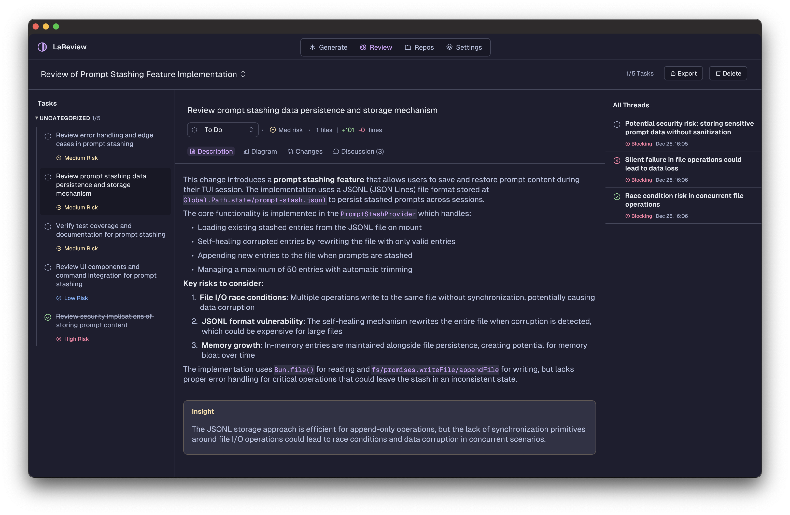
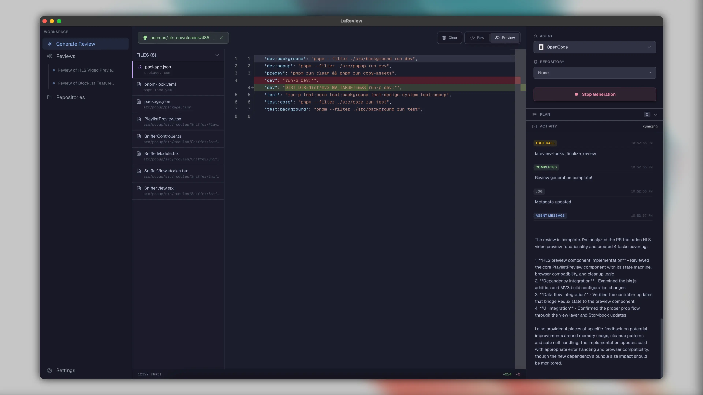
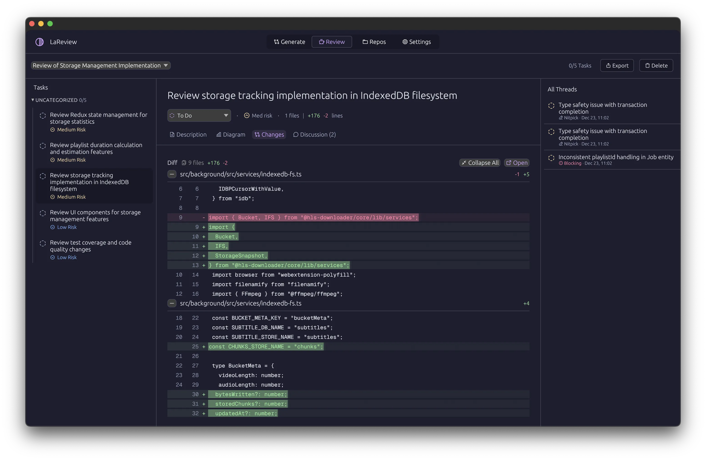
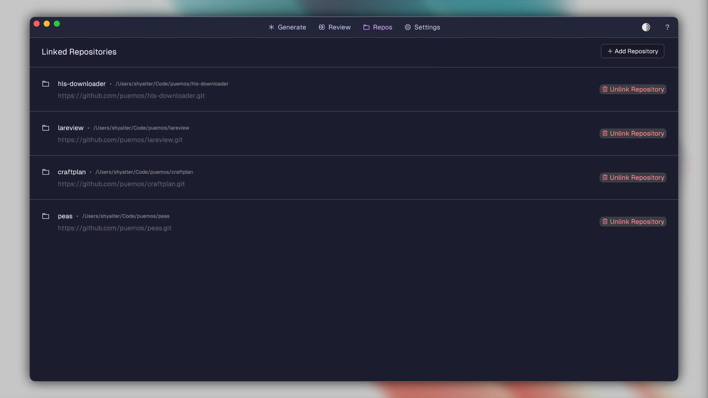
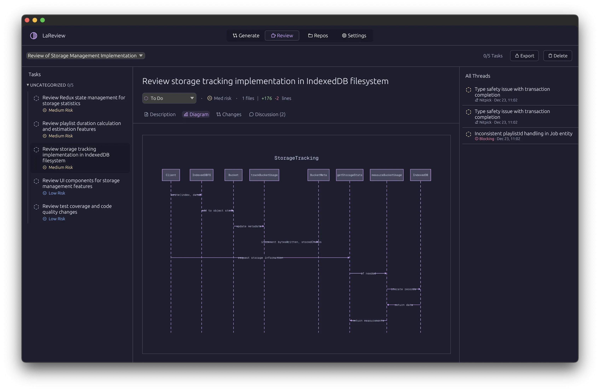
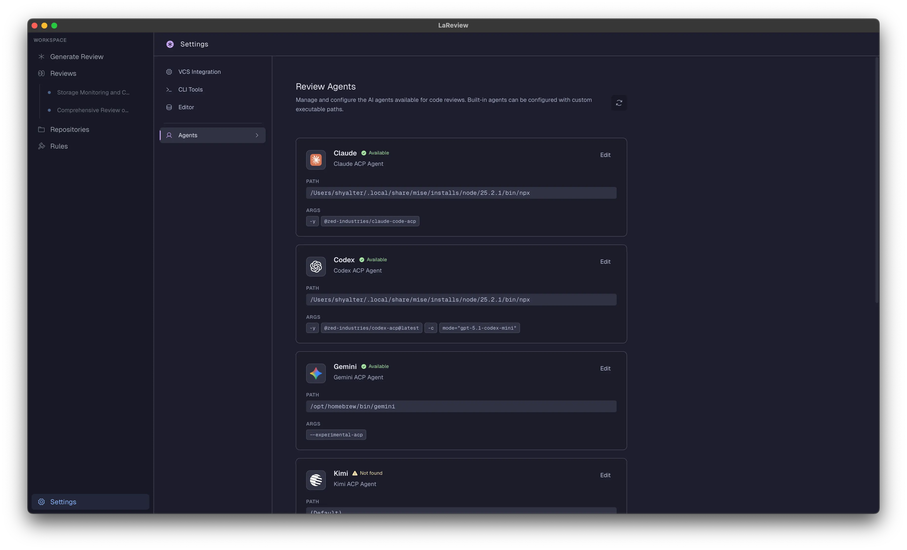
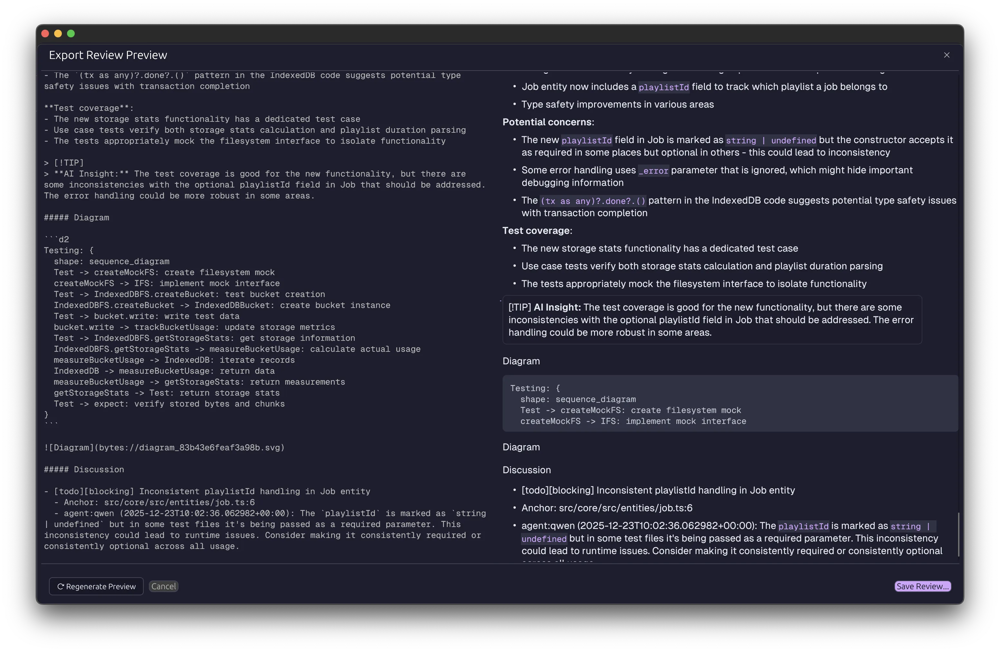

<p align="center">
  <a href="https://github.com/puemos/lareview">
    <picture>
      <source srcset="assets/icons/icon-512.png" media="(prefers-color-scheme: dark)">
      <source srcset="assets/icons/icon-512.png" media="(prefers-color-scheme: light)">
      
    </picture>
  </a>
</p>

<h1 align="center">La Review</h1>

<p align="center"><b>Turn a diff into a review checklist.</b></p>

<p align="center">
  <a href="https://github.com/puemos/lareview/actions/workflows/ci.yml">
    
  </a>
  <a href="https://github.com/puemos/lareview/releases">
    
  </a>
  <a href="LICENSE">
    
  </a>
  <a href="https://www.rust-lang.org">
    
  </a>
</p>

[](assets/screenshots/review.webp)

---

LaReview turns a PR or unified diff into a task tree so you can review changes in a deliberate order instead of scrolling. It’s local-first: state in SQLite, PR fetch via gh, and plan generation via an ACP agent you run.

## Demo

https://github.com/user-attachments/assets/25ca9d3c-33e8-45f8-9ec7-c8aa670488e5

## Key Features

LaReview is designed for a local-first, secure, and focused review experience.

|                                                                                            | Feature                                                                                                                                                                                                                                                                      |
| :----------------------------------------------------------------------------------------- | :--------------------------------------------------------------------------------------------------------------------------------------------------------------------------------------------------------------------------------------------------------------------------- |
|         | **AI-Powered Plan Generation**<br>Input a GitHub PR reference (e.g., `owner/repo#123`) or paste a raw diff. LaReview uses your local ACP agent to analyze the changes and generate a structured review plan based on the author's intent.                                    |
|         | **Structured Task Tree & Notes**<br>Navigate the review as a hierarchical tree. Mark tasks as **To Do**, **In Progress**, or **Done**. Attach contextual notes to specific tasks or lines of code to keep track of your thoughts.                                            |
|    | **Task-Focused Diffs**<br>Stop context switching. When you select a task, the diff viewer only shows the specific hunks relevant to completing that task, isolating the noise.                                                                                               |
|  | **Agent-Generated Feedback Threads**<br>The AI agent doesn't just plan; it actively identifies issues. It can autonomously create feedback threads (nitpicks, blocking issues, or suggestions) anchored to specific lines of code, helping you catch bugs before they merge. |
|             | **Local Repository Context**<br>Link your local Git repositories to LaReview. This gives the AI agent full access to search your codebase and list files, providing maximum context for more accurate and insightful reviews.                                                |
|       | **Visual Diagram View**<br>Visualize the structure and flow of changes with automatically generated diagrams, helping you understand complex refactors faster. (Requires D2).                                                                                                |
|                | **Export & Local-First**<br>No third-party servers. Review state is stored in a local SQLite DB. Export your summary as Markdown. PR data is fetched securely via your own GitHub CLI (`gh`), and planning is handled by your local ACP agent.                               |

## How it works

1. **Input**
   - Paste a unified diff, or
   - Paste a GitHub PR reference: `owner/repo#123` or a PR URL
2. **Fetch (for PRs)**
   - LaReview uses the GitHub CLI (`gh`) locally
3. **Generate a review plan**
   - The review plan is generated by an AI agent you run via ACP (Agent Client Protocol)
4. **Review**
   - Work task-by-task, add notes, track status, and optionally clean completed tasks

## Supported Agents

| <br>Claude | <br>Codex | <br>Gemini | <br>Grok | <br>Kimi | <br>Mistral | <br>OpenCode | <br>Qwen |
| :------------------------------------------------------: | :----------------------------------------------------: | :------------------------------------------------------: | :--------------------------------------------------: | :--------------------------------------------------: | :--------------------------------------------------------: | :----------------------------------------------------------: | :--------------------------------------------------: |

## Requirements

- **Rust nightly** (see `rust-toolchain.toml`)
- **GitHub CLI** if you want to load PRs:
  - Install: `brew install gh` (or your OS package manager)
  - Auth: `gh auth login`
- **D2** (optional): For visual diagram rendering. Install: `brew install d2` (or see [d2lang.com](https://d2lang.com/install))
- **ACP agent** configured on your machine
  - Learn more: https://agentclientprotocol.com/overview/introduction

> [!NOTE]
> LaReview does not require a custom LaReview server. Your PR data is fetched locally via `gh`, and plan generation runs via your chosen ACP agent.

## Installation

### Option A: Download a release

1. Go to the [Releases page](https://github.com/puemos/lareview/releases) and download the latest binary for your operating system.
2. Follow the instructions for your OS below.

#### macOS

Download the `lareview-macos-*.zip` asset and unzip it. You should see `LaReview.app`.

- Drag `LaReview.app` into `/Applications`.
- If macOS blocks it on first run, open **System Settings → Privacy & Security** and allow it.

#### Linux

1.  Download the `lareview-linux.tar.gz` file and extract it.
    ```sh
    tar -xzvf lareview-linux.tar.gz
    ```
2.  Make the binary executable and move it to your path.
    ```sh
    chmod +x ./lareview
    mv ./lareview /usr/local/bin/lareview
    ```

#### Windows

1.  Download the `lareview-windows.zip` file and unzip it.
2.  Place the `lareview.exe` file in a directory that is included in your system's `PATH` environment variable.

### Option B: Run from source

```bash
cargo run
```

### Option C: Build a local macOS .app (dev)

```bash
scripts/build_macos_app.sh
```

#### Linux dependencies

```bash
# Debian/Ubuntu
sudo apt-get update
sudo apt-get install -y libxkbcommon-dev libxkbcommon-x11-dev
```

## Quickstart

1. Start the app:

   ```bash
   cargo run
   ```

2. Open **GENERATE**
   - Paste a unified diff, or a GitHub PR like `owner/repo#123` (or a PR URL)
3. Pick an agent and click generate
4. Switch to **REVIEW**
   - Work through tasks, add notes, and track status

> [!TIP]
> If PR loading fails, run `gh auth status` and then `gh auth login`.

## Usage examples

### Review a GitHub PR

Input:

- `owner/repo#123`
- or `https://github.com/owner/repo/pull/123`

### Review a unified diff

Paste a unified diff directly:

```diff
diff --git a/src/lib.rs b/src/lib.rs
index 123..456 100644
--- a/src/lib.rs
+++ b/src/lib.rs
@@ -1,3 +1,8 @@
+pub fn example() {
+  // ...
+}
```

## Data, paths, and privacy

LaReview stores review state locally.

- macOS DB: `~/Library/Application Support/LaReview/db.sqlite`
- Windows DB: `%APPDATA%\LaReview\db.sqlite` or `%LOCALAPPDATA%\puemos\LaReview\db.sqlite`
- Linux DB: `$XDG_DATA_HOME/lareview/db.sqlite` or `~/.local/share/lareview/db.sqlite`
- Override DB path:

  ```bash
  LAREVIEW_DB_PATH=/path/to/db.sqlite <RUN_COMMAND>
  ```

Executable discovery (GUI apps can start with a minimal PATH):

- LaReview hydrates PATH from your login shell when launched outside a terminal (macOS/Linux). Restart after shell PATH changes.
- You can override individual agent executables in **Settings → Agent Settings**.

Wipe local state:

- Delete the DB file listed above.

## UI overview

### GENERATE

Paste a diff (or PR), pick an agent, and generate a plan. While the agent runs, you get a timeline of what’s happening.


### REVIEW

The review plan is shown as a tree: Intent → Sub-flows → Tasks. Selecting a task shows details plus a unified diff viewer for related hunks. Add notes and mark progress.


Use **Clean done** to remove completed tasks (and their notes) for the current review.

### REPOS

Link local Git repositories to give the AI agent deep context. Once linked, the agent can use tools to search through your codebase and list files, enabling it to understand the wider impact of changes.


### EXPORT

Generate a Markdown summary of your review, including stats, metadata, task details, and diagrams. You can preview and edit the Markdown before saving it to a file.



## Design goals

- **DX**: review flows, not file lists
- **Local-first state**: tasks, notes, and status stored locally in SQLite
- **Security / trust model**: no server in the middle; processing happens through `gh` and your ACP agent
- **Fits your setup**: use ACP instead of a new agent runtime; use `gh` instead of forcing new integrations

## Project status

- Status: ALPHA
- Known limitations:
  - Complex nested diff structures might require manual confirmation in some agents.
- Roadmap:
  - Sync comments with GitHub
  - Support for repo search
  - Support more ACP agents

## Development

- Toolchain: nightly Rust with `rustfmt` and `clippy` components (edition 2024; see `rust-toolchain.toml`)
- Run the app: `cargo run`
- Reset/seed sample data:
  - `cargo run --bin reset_db`
  - `cargo run --bin seed_db`

- Checks:
  - `cargo fmt -- --check`
  - `cargo clippy --all-targets --all-features -- -D warnings`
  - `cargo test`

- Tests:
  - Unit tests: Located alongside modules in `src/` (usually as `tests.rs`)
  - Integration tests: Located in the root `tests/` directory
  - Run all tests: `cargo test`

- Supply chain:
  - `cargo deny check` (used in scheduled CI)

## Docs

- Docs index: [docs/README.md](docs/README.md)
- Architecture overview: [docs/ARCHITECTURE.md](docs/ARCHITECTURE.md)
- Development guide: [docs/DEVELOPMENT.md](docs/DEVELOPMENT.md)

## Contributing

Please read [CONTRIBUTING.md](CONTRIBUTING.md) before submitting a PR.

## Security

See [SECURITY.md](SECURITY.md) for reporting vulnerabilities.

## License

Licensed under either of:
- Apache License, Version 2.0 (LICENSE-APACHE)
- MIT license (LICENSE-MIT)

At your option.
