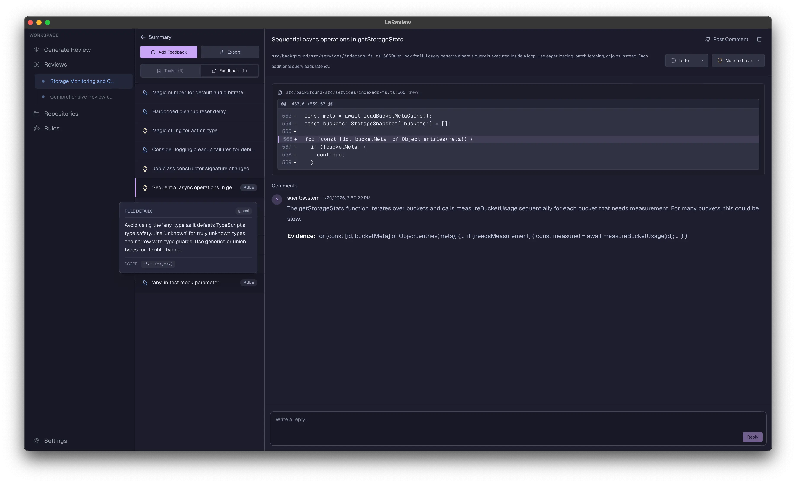
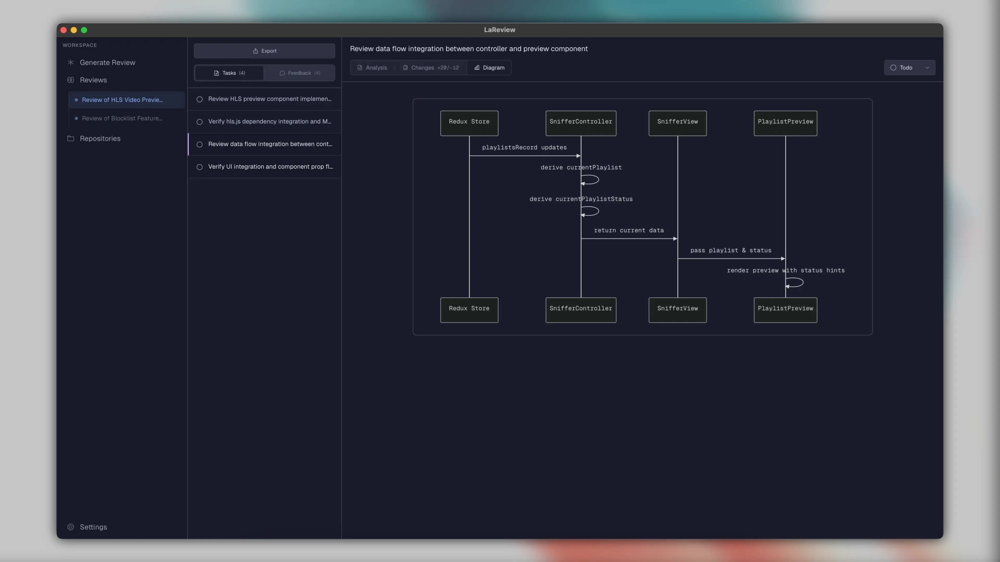
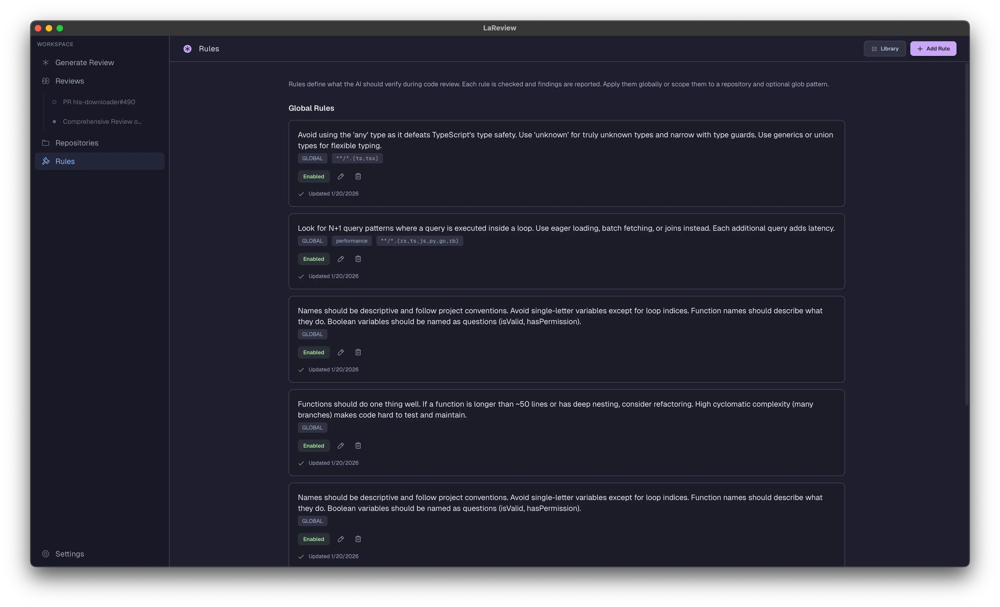

<p align="center">
  <a href="https://lareview.dev">
    <picture>
      
    </picture>
  </a>
</p>

<h1 align="center">La Review</h1>

<p align="center"><b>The Code Review Workbench.</b></p>

<p align="center">
  <a href="https://github.com/puemos/lareview/actions/workflows/ci.yml"></a>
  <a href="https://github.com/puemos/lareview/releases"></a>
  <a href="LICENSE"></a>
  <a href="https://www.rust-lang.org"></a>
</p>

[](assets/screenshots/review.webp)

---

LaReview is a **dev-first code review workbench** for complex changes. It turns a PR or diff into a structured review plan, grouped by flows and ordered by risk, so you can review with depth and understanding.

Unlike auto-review bots that post comment spam, LaReview is a local-first tool that works with your existing AI coding agent to help you ship high-signal feedback.

## Demo

https://github.com/user-attachments/assets/28abaf1e-9100-4484-b6a5-18d8dfec427e

## Key Features

LaReview is designed for a local-first, secure, and focused review experience.

| Screenshot                                                                                    | Feature                                                                                                                                                                                                                   |
| :-------------------------------------------------------------------------------------------- | :------------------------------------------------------------------------------------------------------------------------------------------------------------------------------------------------------------------------ |
|          | **AI-Powered Planning**<br>Input a PR (GitHub/GitLab) or diff. LaReview acts as a staff engineer, looking for flows (e.g. auth, api) and risks to build a structured review plan.                                         |
|              | **Review Summary**<br>Get a bird's-eye view of your review with Issue Checklist, Feedback items, Review Tasks grouped by flow, and a Files Heatmap showing risk distribution.                                             |
|  | **Structured Task Tree**<br>Navigate the review as a hierarchical tree. Mark tasks as **To Do**, **In Progress**, or **Done**. Attach contextual notes to specific tasks or lines of code to keep track of your thoughts. |
|       | **Task-Focused Diffs**<br>Review one logical concern at a time. The workbench isolates relevant code hunks for each task, eliminating noise.                                                                              |
|    | **High-Signal Framework**<br>The AI proactively identifies bugs and authenticates them against your rules. No comment spam—just focused feedback threads anchored to specific lines.                                      |
|              | **Local Context (Zero Data Leaks)**<br>Link local Git repos to give the agent full access to search your codebase. Works with your existing AI coding agent (Claude, etc) and keeps data on your machine.                 |
|          | **Visual Diagrams**<br>Visualize the flow. Automatically generate diagrams to see architectural changes before you read a single line of code. (Requires D2).                                                             |
|                       | **Team Rules**<br>Define rules like "DB queries must have timeouts" or "API changes need a migration note" to enforce standards automatically.                                                                            |
|              | **Git Host Sync**<br>Submit your review feedback directly to GitHub or GitLab PRs with automatic summary generation.                                                                                                      |
|           | **Export & Share**<br>Export your review summary to Markdown with diagrams and code insights. Copy to clipboard or save to file.                                                                                          |
|                   | **CLI Support**<br>Launch reviews from the terminal: `lareview`, `lareview pr owner/repo#123`, `git diff &#124; lareview`, or `lareview --agent claude`.                                                                  |

## How it works

1. **Input**
   - Run `lareview` from terminal (opens GUI with current repo linked), or
   - Paste a unified diff, or
   - Paste a code review link from GitHub or GitLab, or a PR URL
2. **Fetch (for PRs)**
   - LaReview fetches the change locally and prepares the review workspace. No intermediate servers.
3. **Generate a review plan**
   - AI generates a review plan grouped by flows and ordered by risk. You can customize the agent (Claude, OpenAI, etc).
4. **Review**
   - Review task by task with your AI coding agent.
   - Ship focused feedback that authors can act on, without comment spam.

## Terminal Workflow

LaReview includes a CLI that integrates naturally into your developer workflow:

```bash
# Open GUI with current repository linked
lareview

# Review changes between branches
lareview main feature

# Pipe a diff directly to the GUI
git diff HEAD | lareview

# Review a GitHub/GitLab PR
lareview pr owner/repo#123

# Specify an agent
lareview --agent claude
```

The CLI launches the GUI in the background and passes your diff/repo info seamlessly.

## Supported Agents

| <br>Claude | <br>Codex | <br>Gemini | <br>Grok | <br>Kimi | <br>Mistral | <br>OpenCode | <br>Qwen |
| :------------------------------------------------------: | :----------------------------------------------------: | :------------------------------------------------------: | :--------------------------------------------------: | :--------------------------------------------------: | :--------------------------------------------------------: | :----------------------------------------------------------: | :--------------------------------------------------: |

## Requirements

- **Rust nightly** (see `rust-toolchain.toml`)
- **GitHub CLI** (optional):
  - Install: `brew install gh` (or your OS package manager)
  - Auth: `gh auth login`
- **GitLab CLI** (optional):
  - Install: `brew install glab` (or your OS package manager)
  - Auth: `glab auth login`
- **D2** (optional): For visual diagram rendering. Install: `brew install d2` (or see [d2lang.com](https://d2lang.com/install))
- **AI agent** configured on your machine
  - Learn more: https://agentclientprotocol.com/overview/introduction

> [!NOTE]
> LaReview does not require a custom LaReview server. Your PR data is fetched locally via `gh` or `glab`, and plan generation runs via your chosen AI agent.

## Installation

### Option A: Homebrew (Recommended)

Install LaReview via Homebrew with a single command:

#### macOS

```bash
# First, tap the repository
brew tap puemos/tap
# Then install
brew install --cask lareview
```

#### Linux

```bash
brew install puemos/tap/lareview
```

### Option B: Download a release

1. Go to the [Releases page](https://github.com/puemos/lareview/releases) and download the latest binary for your operating system.
2. Follow the instructions for your OS below.

#### macOS

1. Download the `lareview-macos-*.zip` asset and unzip it. You should see `LaReview.app`.
2. Drag `LaReview.app` into `/Applications`.
3. If macOS blocks it on first run, open **System Settings → Privacy & Security** and allow it.
4. To use from terminal, add to PATH (or use the **CLI Installation** button in Settings):
   ```bash
   echo 'export PATH="$PATH:/Applications/LaReview.app/Contents/MacOS"' >> ~/.zshrc
   ```

#### Linux

1.  Download the `lareview-linux.tar.gz` file and extract it.
    ```sh
    tar -xzvf lareview-linux.tar.gz
    ```
2.  Make the binary executable and move it to your path.
    ```sh
    chmod +x ./lareview
    mv ./lareview /usr/local/bin/lareview
    ```

#### WSL (Windows Subsystem for Linux)

LaReview runs natively inside WSL2 as a Linux app. Use the same installation steps as Linux above.

**Optional:** For better Windows integration (opening URLs in your Windows browser), install the [wslu](https://github.com/wslutilities/wslu) package:

```bash
# Ubuntu/Debian
sudo apt install wslu

# Other distros: see https://wslutiliti.es/wslu/install.html
```

If `wslu` is not installed, LaReview will fall back to using `cmd.exe` for opening URLs.

### Option C: One-click CLI installation

Launch LaReview and go to **Settings → CLI Installation** for a one-click setup to add `lareview` to your PATH.

### Option D: Run from source

```bash
cargo run
```

### Option E: Build a local macOS .app (dev)

```bash
scripts/build_macos_app.sh
```

#### Linux dependencies

```bash
# Debian/Ubuntu
sudo apt-get update
sudo apt-get install -y libxkbcommon-dev libxkbcommon-x11-dev
```

## Quickstart

1. Start the app:

   ```bash
   lareview  # From terminal with repo linked
   # OR
   cargo run  # From source
   ```

2. Open **GENERATE**
   - Paste a unified diff, or a GitHub/GitLab PR like `owner/repo#123` (or a PR URL)
   - Or use the terminal: `lareview pr owner/repo#123`
3. Pick an agent and click generate
4. Switch to **REVIEW**
   - Work through tasks, add notes, and track status

> [!TIP]
> If PR loading fails, run `gh auth status` or `glab auth status` and then login.

## Usage examples

### Review a GitHub/GitLab PR

Input:

- `owner/repo#123`
- `https://github.com/owner/repo/pull/123`
- `https://gitlab.com/owner/repo/-/merge_requests/123`

### Review a unified diff

Paste a unified diff directly:

```diff
diff --git a/src/lib.rs b/src/lib.rs
index 123..456 100644
--- a/src/lib.rs
+++ b/src/lib.rs
@@ -1,3 +1,8 @@
+pub fn example() {
+  // ...
+}
```

## Data, paths, and privacy

LaReview stores review state locally.

- macOS DB: `~/Library/Application Support/LaReview/db.sqlite`
- Linux DB: `$XDG_DATA_HOME/lareview/db.sqlite` or `~/.local/share/lareview/db.sqlite`
- Override DB path:

  ```bash
  LAREVIEW_DB_PATH=/path/to/db.sqlite <RUN_COMMAND>
  ```

Executable discovery (GUI apps can start with a minimal PATH):

- LaReview hydrates PATH from your login shell when launched outside a terminal (macOS/Linux). Restart after shell PATH changes.
- You can override individual agent executables in **Settings → Agent Settings**.

Wipe local state:

- Delete the DB file listed above.

## Development

- Toolchain: nightly Rust with `rustfmt` and `clippy` components (edition 2024; see `rust-toolchain.toml`)
- Run the app: `cargo run`
- Reset/seed sample data:

  If you need more advanced control, use the CLI.

  ### CLI Reference

- Checks:
  - `cargo fmt -- --check`
  - `cargo clippy --all-targets --all-features -- -D warnings`
  - `cargo test`

- Logging:
  - LaReview uses the `log` crate with `env_logger`.
  - Set `RUST_LOG` to control log levels:
    - `RUST_LOG=debug cargo run` - Full debug output
    - `RUST_LOG=acp=debug cargo run` - ACP agent debug output only
    - `RUST_LOG=error cargo run` - Errors only
  - Logs appear in the terminal when running from source.

- Tests:
  - Unit tests: Located alongside modules in `src/` (usually as `tests.rs`)
  - Integration tests: Located in the root `tests/` directory
  - Run all tests: `cargo test`

- Supply chain:
  - `cargo deny check` (used in scheduled CI)

## Docs

- Docs index: [docs/README.md](docs/README.md)
- Architecture overview: [docs/ARCHITECTURE.md](docs/ARCHITECTURE.md)
- Development guide: [docs/DEVELOPMENT.md](docs/DEVELOPMENT.md)

## Contributing

Please read [CONTRIBUTING.md](CONTRIBUTING.md) before submitting a PR.

## Security

See [SECURITY.md](SECURITY.md) for reporting vulnerabilities.

## License

Licensed under either of:

- Apache License, Version 2.0 ([LICENSE-APACHE](LICENSE-APACHE))
- MIT license ([LICENSE-MIT](LICENSE-MIT))

At your option.
