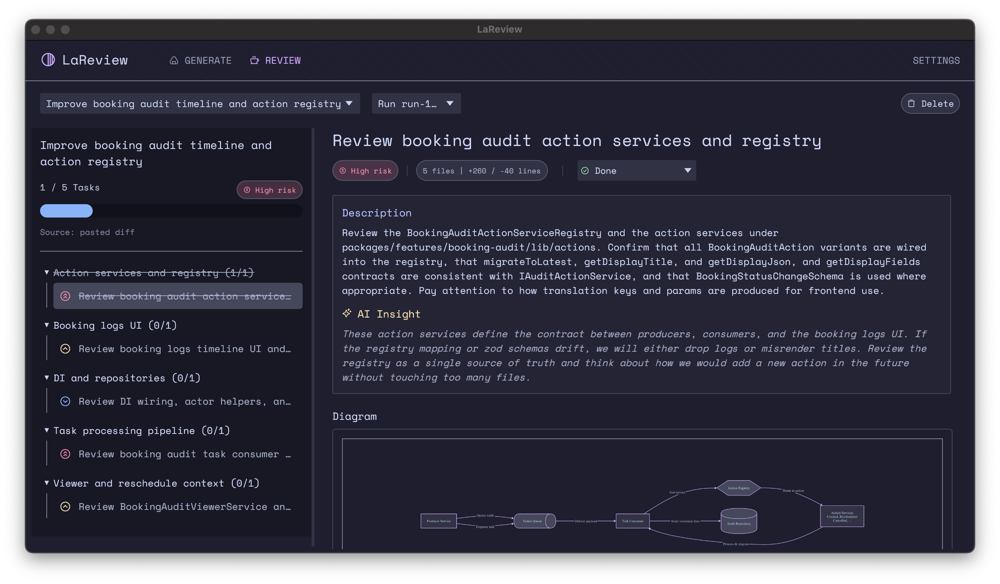

<p align="center">
  <a href="https://github.com/puemos/lareview">
    <picture>
      <source srcset="assets/lareview-icon.svg" media="(prefers-color-scheme: dark)">
      <source srcset="assets/lareview-icon.svg" media="(prefers-color-scheme: light)">
      
    </picture>
    LaReview
  </a>
</p>

<p align="center"><b>Intent-driven code review planning for GitHub PRs and diffs.</b></p>

<p align="center">
  <a href="https://github.com/puemos/lareview/actions/workflows/ci.yml">
    
  </a>
  <a href="https://github.com/puemos/lareview/releases">
    
  </a>
  <a href="LICENSE">
    
  </a>
  <a href="https://www.rust-lang.org">
    
  </a>
</p>

[](assets/screenshots/tasks.png)

---

LaReview turns a pull request or unified diff into a review plan so you can verify a change’s story step by step:

**Intent → Sub-flows → Tasks**

Instead of scrolling through a flat file diff, you review what the PR is trying to do and check each concrete step.

## Demo

<video src="assets/videos/demo.mp4" controls></video>

## Screenshots

### Generate a plan from a PR or diff


### Review plan as a tree with task details


### Task diff viewer


### Diagram viewer


### Settings


## What you get
- **A plan you can review**: Intent, sub-flows, and tasks you can mark **To Do**, **In Progress**, **Done**, or **Ignored**
- **Task-focused diffs**: each task shows the relevant hunks in a unified diff viewer
- **Notes**: attach notes to tasks (optionally tied to file + line)
- **Local-first**: review state stored in SQLite on your machine
- **No LaReview server**: PR metadata and diffs fetched locally via `gh`; plan generated via your ACP agent

## How it works
1. **Input**
   - Paste a unified diff, or
   - Paste a GitHub PR reference: `owner/repo#123` or a PR URL
2. **Fetch (for PRs)**
   - LaReview uses the GitHub CLI (`gh`) locally
3. **Generate plan**
   - The plan is generated by an AI agent you run via ACP (Agent Client Protocol)
4. **Review**
   - Work task-by-task, add notes, track status, and optionally clean completed tasks

## Requirements
- **Rust nightly** (see `rust-toolchain.toml`)
- **GitHub CLI** if you want to load PRs:
  - Install: `brew install gh` (or your OS package manager)
  - Auth: `gh auth login`
- **ACP agent** configured on your machine
  - Learn more: https://agentclientprotocol.com/overview/introduction

> [!NOTE]
> LaReview does not require a custom LaReview server. Your PR data is fetched locally via `gh`, and plan generation runs via your chosen ACP agent.

## Installation

### Option A: Download a release (recommended)
1. Go to the Releases page: https://github.com/puemos/lareview/releases
2. Download the binary for your OS
3. Put it on your PATH

<!-- TODO(install): Add the real binary name and a short example.
Example:
  macOS/Linux: chmod +x lareview && mv lareview /usr/local/bin
  Windows: place lareview.exe somewhere on PATH
-->

### Option B: Install from source with Cargo
```bash
# From crates.io (if/when published)
cargo install lareview

# Or from Git
cargo install --git https://github.com/puemos/lareview.git --locked
````

### Option C: Run from source (fastest to try)

```bash
cargo run
```

#### Linux dependencies

```bash
# Debian/Ubuntu
sudo apt-get update
sudo apt-get install -y libxkbcommon-dev libxkbcommon-x11-dev
```

## Quickstart

1. Start the app:

   ```bash
   cargo run
   ```
2. Open **GENERATE**

   * Paste a unified diff, or a GitHub PR like `owner/repo#123` (or a PR URL)
3. Pick an agent and click generate
4. Switch to **REVIEW**

   * Work through tasks, add notes, and track status

> [!TIP]
> If PR loading fails, run `gh auth status` and then `gh auth login`.

## Usage examples

### Review a GitHub PR

Input:

* `owner/repo#123`
* or `https://github.com/owner/repo/pull/123`

### Review a unified diff

Paste a unified diff directly:

```diff
diff --git a/src/lib.rs b/src/lib.rs
index 123..456 100644
--- a/src/lib.rs
+++ b/src/lib.rs
@@ -1,3 +1,8 @@
+pub fn example() {
+  // ...
+}
```

## Data, paths, and privacy

LaReview stores review state locally.

* DB: `.lareview/db.sqlite` (in the current working directory)
* Logs (ACP/MCP): `.lareview/logs/`
* Override DB path:

  ```bash
  LAREVIEW_DB_PATH=/path/to/db.sqlite <RUN_COMMAND>
  ```

Wipe local state:

* Delete `.lareview/db.sqlite` (and optionally `.lareview/logs/`)

## UI overview

### GENERATE

Paste a diff (or PR), pick an agent, and generate a plan. While the agent runs, you get a timeline of what’s happening.

<!-- TODO(screenshot): docs/assets/generate.png -->


### REVIEW

The plan is shown as a tree: Intent → Sub-flows → Tasks. Selecting a task shows details plus a unified diff viewer for related hunks. Add notes and mark progress.

<!-- TODO(screenshot): docs/assets/review.png -->


Use **Clean done** to remove completed tasks (and their notes) for the current review.

## Design goals

* **DX**: review flows, not file lists
* **Local-first state**: tasks, notes, and status stored locally in SQLite
* **Security / trust model**: no server in the middle; processing happens through `gh` and your ACP agent
* **Fits your setup**: use ACP instead of a new agent runtime; use `gh` instead of forcing new integrations

## Project status

* Status: ALPHA
* Known limitations:
  * Big diffs may take a while to process
* Roadmap:
  * Export review as markdown
  * Sync comments with GitHub
  * Support for repo search
  * Support more ACP agents

## Development

* Toolchain: nightly Rust with `rustfmt` and `clippy` components (edition 2024; see `rust-toolchain.toml`)
* Run the app: `cargo run`
* Reset/seed sample data:

  * `cargo run --bin reset_db`
  * `cargo run --bin seed_db`
* Checks:

  * `cargo fmt -- --check`
  * `cargo clippy --all-targets --all-features -- -D warnings`
  * `cargo test`
* Supply chain:

  * `cargo deny check` (used in scheduled CI)

## Docs

* Docs index: [docs/README.md](docs/README.md)
* Architecture overview: [docs/ARCHITECTURE.md](docs/ARCHITECTURE.md)
* Development guide: [docs/DEVELOPMENT.md](docs/DEVELOPMENT.md)

## Contributing

Please read [CONTRIBUTING.md](CONTRIBUTING.md) before submitting a PR.

## Security

See [SECURITY.md](SECURITY.md) for reporting vulnerabilities.

## License

MIT, see [LICENSE](LICENSE).