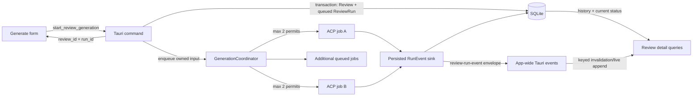

# Plan 001: Run reviews as concurrent background jobs

> **Executor instructions**: Follow this plan step by step. Run every
> verification command and confirm the expected result before moving to the
> next step. If anything in the "STOP conditions" section occurs, stop and
> report—do not improvise. When done, update the status row for this plan in
> `plans/README.md` unless a reviewer told you they maintain the index.
>
> **Drift check (run first)**:
> `git diff --stat 56e73f1..HEAD -- src frontend/src tests examples docs README.md`
> If an in-scope file changed since this plan was written, compare the
> "Current state" excerpts against the live code before proceeding. A material
> mismatch is a STOP condition.

## Status

- **Priority**: P1
- **Effort**: L (roughly 5–8 engineering days, including tests and UX QA)
- **Risk**: HIGH — changes process lifecycle, SQLite write concurrency, IPC, and
  the primary Generate/Review workflow
- **Depends on**: none
- **Category**: direction
- **Planned at**: commit `56e73f1`, 2026-08-06
- **Approval state**: approved and implemented with the Activity-first scope below

### Approved UX clarification

This clarification supersedes conflicting UI details later in the original proposal:

- Generate contains only the review input and configuration; it never owns run activity.
- Starting creates and opens a Review immediately.
- While its run is queued/running—or stops before completion—the Review page owns the activity and terminal context.
- Once the run completes, that same route automatically renders the pre-existing Review UI.
- Activity follows the newest entry only while the user remains near the bottom; scrolling up pauses following until the user returns or chooses **Jump to latest**.

## Approval summary

Approve this plan with the following product decisions:

1. Starting a review returns immediately after the review and run are stored.
   The app opens that review's Activity view while generation continues.
2. The Generate Review screen remains available during every active run. A
   user can start another review without stopping or replacing the first.
3. Run at most **two** ACP generations concurrently. Further starts succeed but
   enter a visible `queued` state until a slot is free.
4. A running review is usable: its source and full diff/files are available
   immediately; tasks, feedback, metadata, and activity appear incrementally.
5. Activity is stored locally with the run and remains available after
   navigation or an app restart. Retention is bounded to avoid unbounded DB
   growth.
6. Cancelling or failing a run keeps the review, diff, partial output, and
   activity. It does not delete the review.
7. Closing the desktop app normally stops its child processes and marks their
   runs `interrupted`. After a crash, the next launch performs the same recovery
   for leftover `queued`/`running` rows. There is no daemon, resume, or automatic
   retry in this version.
8. A review cannot be deleted while its active run is queued or running. The UI
   asks the user to cancel it first, preventing writes into a deleted review.

If any of these decisions are not acceptable, revise this plan before writing
code; they determine the job manager, schema, and UI contracts.

## Why this matters

Generation currently behaves like a modal operation even though the agent runs
off the UI thread. The frontend awaits one long Tauri invocation, stores exactly
one run's progress in global Zustand fields, and refuses another start while the
first invocation is pending. That makes a multi-minute local review generation
own the whole product workflow.

After this plan lands, a review is a first-class job: it appears in the sidebar
as soon as it is accepted, can be inspected while it evolves, and no longer
prevents other work. The design preserves LaReview's local-first model and uses
the existing review/run separation rather than adding a parallel job entity.

## Product specification

### Primary workflow

1. The user prepares a diff or fetches a PR/MR, selects an agent and optional
   repository snapshot access, then clicks **Start Review**.
2. The button enters a short `Starting…` state only while validation and the
   initial SQLite transaction run. It is not tied to the lifetime of the agent.
3. The backend returns `{ review_id, run_id, status: "queued" }`. The new review
   is already visible in the sidebar and its diff is already loadable.
4. The app selects that review and opens its **Activity** view. If capacity is
   available, status changes from Queued to Running; otherwise the view says
   that the review is waiting for an execution slot.
5. The user may browse **Overview**, **Files & Tasks**, or **Activity**, or
   navigate anywhere else. The **Generate Review** entry is enabled, with a
   fresh form, so another job can be started.
6. Any review that finishes in the background updates its sidebar state and
   shows one in-app toast. The toast has an **Open** action that selects the
   completed review without interrupting other jobs.

### Run state model

| State | User label | Actions | Transition rules |
|---|---|---|---|
| `queued` | Queued | View diff/activity, cancel | `running` or `cancelled` |
| `running` | Analyzing | View all live output, cancel | `completed`, `failed`, or `cancelled` |
| `completed` | Ready | Review, export, push, delete | terminal |
| `failed` | Failed | Inspect error/partial work, open in Generate, delete | terminal |
| `cancelled` | Cancelled | Inspect partial work, open in Generate, delete | terminal |
| `interrupted` | Interrupted | Inspect partial work, open in Generate, delete | terminal; assigned on startup recovery |

Status transitions must be conditional in SQLite. A late success callback must
never overwrite `cancelled`, and an MCP `finalize_review` call must not own the
run's terminal state.

### Review detail while work is active

- Add a persistent run-status header above all three views. It contains the
  status, agent, elapsed time, and a Cancel button only for queued/running runs.
- **Overview** renders available source metadata, summary, tasks, checks, and
  feedback. Empty sections use generation-aware copy such as “Still analyzing”
  instead of looking like a completed review with no findings.
- **Files & Tasks** loads the canonical diff from `review_runs.diff_text`
  immediately. Users may browse files and create manual feedback while the
  agent is running. Agent-created tasks and feedback appear incrementally.
- **Activity** contains the evolving agent plan and a chronological timeline of
  status changes, messages, thoughts, tool calls, task/feedback additions,
  metadata changes, completion, cancellation, and errors.
- Export and push-to-VCS actions stay disabled until `completed`, with a tooltip
  that explains why. File browsing and manual notes do not need to wait.
- Failed/cancelled/interrupted states show the terminal reason and an **Open in
  Generate** action that pre-fills the diff/source so the user can choose agent
  settings and start a new review. Exact automatic retry is deferred.

### Navigation and list behavior

- Every queued/running review has its own spinner/status dot in the sidebar.
- The Reviews label shows the number of non-terminal runs when that count is
  greater than zero.
- Selecting one running review never changes another run's progress or cancel
  target.
- When the selected review changes, clear selected task, selected feedback, and
  selected file so IDs from the previous review cannot leak into the new view.
- Deleting a non-terminal review is rejected by the backend as well as disabled
  in the UI. Cancellation keeps the row; deletion becomes available after the
  terminal event arrives.

### Failure and recovery behavior

- Validate the requested agent and the basic diff contract before creating the
  database rows. Obvious preflight errors remain on the Generate screen and do
  not create an empty review.
- Snapshot creation happens inside the queued job. A snapshot failure changes
  the run to `failed` and records the reason in its Activity view.
- Cancelling a queued run must not launch an agent or create a snapshot.
- Cancelling a running run must terminate the ACP process group through the
  existing cancellation path, clean its snapshot, and retain partial data.
- On startup, replace the existing “mark stale runs failed” behavior with an
  atomic `queued/running -> interrupted` recovery and an explanatory terminal
  activity event.
- Distinguish a user Cancel from app shutdown. User cancellation ends as
  `cancelled`; normal shutdown and crash recovery end as `interrupted`.
- Event persistence or UI emission errors must be logged and surfaced where
  possible, but an individual activity-log write must not kill an otherwise
  healthy review generation. Run-status persistence remains mandatory.

### Product limits and non-goals

- The default and only v1 concurrency limit is two. Do not add a Settings
  control until resource use across supported harnesses has been measured.
- Background means “independent of the current screen while LaReview is open.”
  It does not mean execution after the app exits.
- Do not add a daemon, cloud queue, operating-system notification plugin,
  pause/resume, automatic retry, cross-device sync, or changes to ACP itself.
- Do not combine same-source or same-diff reviews automatically; two explicit
  starts create two independent reviews.
- Do not redesign the Inbox, repository linking, rules, learning, or landing
  page as part of this work.

### Success measures

- Starting a valid review returns control and opens its persisted detail view
  without waiting for the agent process to finish.
- Two fake-agent reviews demonstrably overlap in execution; a third is queued
  and starts after one slot is released.
- A mounted run shows a persisted or live activity update within one second of
  receipt from the ACP client under normal local conditions.
- Navigation, remounting, and app restart do not lose already-persisted activity.
- No test produces `SQLITE_BUSY`/`database is locked`, an orphaned agent process,
  or a terminal-state reversal.

## Current state

The implementation already has useful primitives, but they are connected as a
single foreground operation:

- `src/domain/review.rs` defines `ReviewRunStatus` with queued, running,
  completed, failed, and cancelled. Add `interrupted`; do not create a second
  job-status enum.
- `src/state/mod.rs:26-45` stores cancellation tokens by run ID, so backend
  cancellation is already keyed rather than globally singular:

  ```rust
  pub struct AppState {
      pub db: Arc<Mutex<Database>>,
      // ...
      pub active_runs: Arc<Mutex<HashMap<String, CancellationToken>>>,
  }
  ```

- `src/commands/generation.rs:134-157` awaits the entire generation inside the
  Tauri command, and `frontend/src/hooks/useTauri.ts:281-302` mirrors that as a
  promise that resolves only when the job is complete.
- `src/commands/generation.rs:179-235` creates the optional repository snapshot
  before the review/run rows are saved. Move this work behind the accepted job
  boundary so the initial command can return quickly.
- `src/commands/generation.rs:239-270` constructs the review and its run, but
  starts the run directly in `Running`. The new start path must create both in
  one transaction with status `Queued` before enqueueing.
- `src/commands/generation.rs:306-393` adapts ACP `ProgressEvent` values into one
  caller-owned Tauri `Channel`. Replace that channel with a run-ID envelope that
  is persisted and then emitted through the app-wide Tauri event bus.
- `src/commands/generation.rs:406-515` registers cancellation, awaits the ACP
  worker, and chooses the terminal status. Preserve this orchestration but make
  it an owned spawned job, and stop deleting the review on cancellation at
  lines 508-510.
- `src/infra/acp/task_mcp_server/task_ingest.rs:295-381` updates review metadata
  and also marks the run completed. Remove terminal-status ownership from the
  MCP server; only the job runner may commit a terminal transition.
- `src/infra/db/database.rs:27-43` opens SQLite without WAL or a busy timeout,
  while each MCP subprocess opens its own connection to the same file. Two
  simultaneous agents therefore need connection-level concurrency settings.
- `src/infra/db/database.rs:690-805` already exposes running/queued reviews and
  run status to the frontend. Extend these queries with terminal timestamps and
  error information instead of creating a separate status endpoint.
- `src/infra/db/database.rs:1026-1031` currently maps stale non-terminal work to
  `failed`. Change this to `interrupted` and record why.
- `frontend/src/contexts/GenerationContext.tsx:43-58` has a single
  `isGeneratingRef`, explicitly returning `false` on a second start.
- `frontend/src/store/index.ts:33-55` stores one `runId`, one `isGenerating`, one
  plan, and one `progressMessages` list. Run activity must become server/query
  state keyed by run ID; Zustand should retain only draft and selection state.
- `frontend/src/contexts/GenerationContext.tsx:210-230` waits for completion
  before selecting the new review and showing success. Select it from the new
  start-command response instead.
- `frontend/src/hooks/useReview.ts:31-37` and
  `frontend/src/hooks/useTasks.ts:25-31` use 30-second stale data with no active
  refresh. App-wide run events must invalidate the precise run/review queries.
- `frontend/src/components/Layout/Sidebar.tsx:147-153` already renders a spinner
  for every review whose active run is queued/running. Preserve and extend this
  per-review presentation.
- `frontend/src/components/Review/ReviewView.tsx` can parse and display a run's
  stored diff before tasks exist. Add explicit active/empty/error states rather
  than replacing the current diff viewer.
- Existing progress UI lives in
  `frontend/src/components/Generate/LiveActivityFeed.tsx` and
  `frontend/src/components/Generate/PlanOverview.tsx`. Generalize/reuse these in
  the review Activity view instead of building a second timeline style.

Repository conventions to match:

- Layer responsibilities are documented in `docs/ARCHITECTURE.md`: domain types
  stay pure, SQLite code belongs in `src/infra/db/`, runtime app state belongs in
  `src/state/`, Tauri IPC belongs in `src/commands/`, and React/TanStack Query
  own presentation/server-state synchronization.
- SQLite schema evolution currently happens idempotently inside
  `Database::create_schema` in `src/infra/db/database.rs`. The SQL files under
  `migrations/` are not wired into startup despite their README; follow the
  live inline pattern in this plan and do not rely on a standalone migration
  file.
- Backend errors return `Result<_, String>` at the Tauri boundary and are shown
  through Sonner toasts. Avoid `unwrap/expect` outside tests, per
  `CONTRIBUTING.md`.
- Frontend server state uses TanStack Query keys in
  `frontend/src/lib/query-keys.ts`; Zustand is for UI/draft selection.
- Tests are colocated for units, in `tests/` for integration, and use Vitest +
  Testing Library in `frontend/src/**/__tests__/`.

## Target technical architecture



### Backend contracts

Add or formalize these data contracts; names may follow Rust conventions but
their semantics must not drift:

```rust
pub struct StartReviewGenerationInput {
    pub diff_text: String,
    pub agent_id: String,
    pub repo_id: Option<String>,
    pub source: Option<ReviewSource>,
    pub use_snapshot: bool,
    pub agent_config: Vec<AgentConfigSelection>,
}

pub struct StartReviewGenerationResult {
    pub review_id: ReviewId,
    pub run_id: ReviewRunId,
    pub status: ReviewRunStatus, // queued on successful return
}

pub struct ReviewRunEvent {
    pub id: i64,                 // SQLite monotonic cursor
    pub review_id: ReviewId,
    pub run_id: ReviewRunId,
    pub kind: ReviewRunEventKind,
    pub payload: serde_json::Value,
    pub created_at: String,
    pub truncated: bool,
}
```

Use one static Tauri event name, `review-run-event`, whose payload always
contains both `review_id` and `run_id`. Do not create one dynamic event name per
run. Add these commands:

- `start_review_generation(input) -> StartReviewGenerationResult`
- `cancel_review_generation(run_id) -> ()` (idempotent)
- `get_review_run_events(run_id, after_id?) -> Vec<ReviewRunEvent>`

The existing `generate_review`/Channel and `stop_generation` API may be removed
after all frontend callers and tests move in the same change. There is no CLI
consumer of that internal Tauri command.

### Persistence model

Extend `review_runs` additively with nullable `started_at`, `finished_at`, and
`error_message`. Add `ReviewRunStatus::Interrupted` and map unknown status text
to a logged/returned data error rather than silently treating it as completed
on lifecycle-critical reads.

Add a `review_run_events` table:

```sql
CREATE TABLE IF NOT EXISTS review_run_events (
    id INTEGER PRIMARY KEY AUTOINCREMENT,
    review_id TEXT NOT NULL,
    run_id TEXT NOT NULL,
    kind TEXT NOT NULL,
    payload_json TEXT NOT NULL,
    payload_bytes INTEGER NOT NULL,
    truncated INTEGER NOT NULL DEFAULT 0,
    created_at TEXT NOT NULL,
    FOREIGN KEY(review_id) REFERENCES reviews(id) ON DELETE CASCADE,
    FOREIGN KEY(run_id) REFERENCES review_runs(id) ON DELETE CASCADE
);
CREATE INDEX IF NOT EXISTS idx_review_run_events_run_cursor
ON review_run_events(run_id, id);
```

Configure every file-backed SQLite connection before schema work with foreign
keys enabled, a 5-second busy timeout, WAL journaling, and `synchronous=NORMAL`.
Keep in-memory test connections supported (SQLite may report `memory` instead
of `wal`). Create the initial review and queued run in one transaction.

Persist meaningful activity, but coalesce message/thought deltas by message ID
and flush them at most every 250 ms or 2 KiB. Cap a serialized event payload at
32 KiB and a run's retained activity at 5 MiB; set `truncated=true` when content
is clipped and prune the oldest non-terminal activity rows when the run exceeds
the cap. Never prune status/terminal/error events. Raw activity remains local
and is deleted through the existing review cascade.

### Generation coordinator

Create `src/state/generation.rs` with a `GenerationCoordinator` owned by
`AppState`:

- an `Arc<tokio::sync::Semaphore>` with two permits;
- a run-ID keyed control map holding a `CancellationToken` and lifecycle state;
- an enqueue method that accepts fully owned job input and returns immediately;
- cancellation that works both while waiting for a permit and while running;
- cleanup that removes the control entry on every terminal path.

Generate IDs in the Rust start command. Validate the agent and diff, resolve the
candidate command, transactionally store `Review + Queued ReviewRun`, emit the
queued event, enqueue, and return. The spawned runner then:

1. waits for a permit with `tokio::select!` against cancellation;
2. conditionally transitions queued -> running and records `started_at`;
3. creates the optional snapshot and resolves rules;
4. invokes the existing `generate_tasks_with_acp` worker with the run token;
5. adapts ACP progress into the persisted/evented run stream;
6. cleans the snapshot and process resources;
7. commits exactly one conditional terminal transition with `finished_at` and
   optional `error_message`;
8. emits the terminal run event, releases the permit, and removes control state.

The main coordinator is the only terminal-status owner. In particular, remove
the `Completed` update from `update_review_metadata` in
`src/infra/acp/task_mcp_server/task_ingest.rs`; that tool should only update
review title/summary. Treat ACP `Finalized` as activity, not proof that all
worker/process cleanup succeeded.

## Commands you will need

| Purpose | Command | Expected on success |
|---|---|---|
| Rust format | `cargo fmt -- --check` | exit 0, no diff |
| Rust lint | `cargo clippy --all-targets --all-features -- -D warnings` | exit 0, no warnings |
| Rust tests | `LAREVIEW_CONFIG_PATH=$(mktemp) LAREVIEW_DATA_HOME=$(mktemp -d) LAREVIEW_DB_PATH=$(mktemp) RUST_TEST_THREADS=1 cargo test --all-targets` | exit 0, all tests pass |
| Frontend lint | `pnpm --dir frontend lint` | exit 0, zero warnings |
| Frontend tests | `pnpm --dir frontend test` | exit 0, all Vitest tests pass |
| Frontend build | `pnpm --dir frontend build` | exit 0 |
| Whitespace review | `git diff --check` | exit 0, no whitespace errors |
| Scope review | `git status --short` | only in-scope files plus plan status changed |

The Rust test command intentionally isolates app configuration, data, and SQLite
state as CI does. If `mktemp` creates an existing empty DB file that rusqlite
cannot initialize on a target platform, use a path inside one validated
`mktemp -d` directory; do not point tests at the user's LaReview database.

## Scope

**In scope** (only these existing areas and named new files):

- `src/domain/review.rs`
- `src/state/mod.rs`
- `src/state/generation.rs` (new)
- `src/commands/generation.rs`
- `src/commands/review.rs`
- `src/commands/mod.rs` and `src/main.rs` only for command registration/signatures
- `src/infra/db/database.rs`
- `src/infra/db/repository/mod.rs`
- `src/infra/db/repository/review_run.rs`
- `src/infra/db/repository/review_run_event.rs` (new)
- `src/infra/acp/task_mcp_server/task_ingest.rs`
- `src/infra/acp/task_mcp_server/feedback_ingest.rs` only for the added
  `ReviewRun` lifecycle fields/status wiring
- `src/infra/acp/task_mcp_server/tests.rs`,
  `src/infra/db/repository/tests.rs`, and
  `tests/database_workflow_integration.rs` for compiler-required lifecycle
  fixture updates and the new assertions
- `examples/fake_acp_agent.rs` for deterministic delay/failure test modes
- `tests/background_generation_integration.rs` (new) and directly relevant
  repository/database tests
- `frontend/src/App.tsx`
- `frontend/src/types/index.ts`
- `frontend/src/hooks/useTauri.ts`
- `frontend/src/hooks/useReview.ts`
- `frontend/src/hooks/useReviews.ts`
- `frontend/src/hooks/useTasks.ts`
- `frontend/src/hooks/useFeedback.ts` and `frontend/src/hooks/useIssueChecks.ts`
  only for run-event invalidation/active refresh
- `frontend/src/hooks/useReviewRunEvents.ts` (new)
- `frontend/src/lib/query-keys.ts`
- `frontend/src/contexts/GenerationContext.tsx`,
  `frontend/src/contexts/generation-context.ts`, and their tests (renaming to a
  run-oriented provider is allowed if all imports move atomically)
- `frontend/src/store/index.ts` and store tests
- `frontend/src/components/Generate/GenerateView.tsx`
- `frontend/src/components/Generate/AgentConfigPanel.tsx`
- `frontend/src/components/Generate/LiveActivityFeed.tsx`
- `frontend/src/components/Generate/PlanOverview.tsx`
- `frontend/src/components/Layout/Sidebar.tsx` and tests
- `frontend/src/components/Review/ReviewView.tsx`
- `frontend/src/components/Review/ReviewSidebar.tsx`
- `frontend/src/components/Review/ReviewSummary/ReviewSummary.tsx`
- `frontend/src/components/Review/ReviewRunHeader.tsx` (new)
- `frontend/src/components/Review/ReviewActivity.tsx` (new)
- directly corresponding frontend tests/mocks
- `docs/ARCHITECTURE.md` and the generation workflow/status wording in
  `README.md`
- `plans/README.md` status only

**Out of scope** (do not touch even if related):

- `landing/`
- ACP protocol behavior, prompts, supported-agent discovery, or harness versions
- Inbox candidate discovery, rules, learning compaction, exports, and VCS push
  internals except disabling their UI while a run is non-terminal
- a standalone service/daemon or restart-resume implementation
- configurable concurrency, automatic retries, rerunning as another run of the
  same Review entity, or schema migration-framework cleanup
- broad refactors of the existing database or frontend store
- publishing, release, push, or PR creation

## Git workflow

- Branch: `feat/background-review-runs`
- Use small logical commits because the change is high risk. Match the observed
  repository style, for example:
  - `feat(review): persist independently running review jobs`
  - `feat(review): keep live runs navigable`
  - `test(review): prove concurrent lifecycle isolation`
- Do not push or open a PR unless the operator explicitly asks.

## Steps

### Step 1: Establish the lifecycle and SQLite concurrency foundation

1. Add `Interrupted` to `ReviewRunStatus` and explicit helpers for
   `is_terminal()`/`is_active()`. Audit all matches and string parsing. Lifecycle
   reads must not silently convert unknown values to `Completed`.
2. Add the three run lifecycle columns and `review_run_events` table/index using
   the idempotent live schema pattern in `Database::create_schema`.
3. Add WAL, `synchronous=NORMAL`, foreign keys, and a 5-second `busy_timeout` to
   every file-backed connection before schema initialization.
4. Add `ReviewRunEventRepository` methods to append, list after a cursor, and
   enforce the retention rules. Payload serialization/truncation lives at this
   boundary so every caller gets the same limit.
5. Extend `ReviewRunRepository` with explicit conditional methods:
   `mark_running_if_queued`, `finish_if_active`, and
   `interrupt_stale_active_runs`. Each returns whether it actually changed a
   row; terminal-to-terminal rewrites are rejected.
6. Add one transaction method that creates the Review and its Queued ReviewRun
   together. A start must never expose one without the other.

**Verify**:

- `cargo test infra::db --lib` -> all DB/repository tests pass.
- New tests prove event ordering/cascade, additive migration of an old schema,
  valid transition paths, rejection of terminal reversal, and two independent
  file-backed connections writing without a lock error.
- `cargo fmt -- --check` -> exit 0.

### Step 2: Introduce the bounded backend job coordinator

1. Add `GenerationCoordinator` under `src/state/` with exactly two permits and
   run-keyed cancellation controls. Do not hold a standard mutex across `.await`.
2. Split the current command into a short `start_review_generation` path and an
   owned `run_generation_job` future. Move snapshot creation, rules resolution,
   ACP waiting, and cleanup into the future.
3. Resolve/validate the agent and validate the diff before the initial DB
   transaction. Generate review/run IDs in Rust.
4. Persist Queued + event, enqueue, and return the IDs. Make failure between
   persistence and enqueue impossible by construction: initialize the
   coordinator with `AppState` and make enqueue an infallible handoff to the
   owned runtime. Perform every fallible precondition before the initial
   transaction.
5. Await the semaphore with cancellation. A cancelled queued run transitions
   directly to Cancelled and never invokes snapshot/ACP code.
6. Route every ACP progress event through one sink that coalesces high-frequency
   deltas, persists the normalized event, and emits `review-run-event` with the
   persisted event ID.
7. Make completion/failure/cancellation conditional and terminal exactly once.
   Keep cancelled and failed reviews. Remove terminal-status mutation from MCP
   metadata finalization.
8. Make cancellation idempotent by run ID. A cancel request for an already
   terminal run succeeds without changing it; a nonexistent ID returns a typed
   not-found error.
9. Add coordinator shutdown with a distinct shutdown reason. A normal app exit
   cancels/joins child work with a short bounded grace period and marks those
   runs Interrupted; it must not report them as user-cancelled. Crash leftovers
   are handled by startup recovery.

**Verify**:

- Coordinator unit tests with controllable futures prove a maximum of two
  simultaneous jobs, FIFO admission for a third job, queued cancellation, and
  independent cancellation targets.
- A cancellation-vs-completion race test proves the stored status never changes
  away from the first terminal state.
- `cargo clippy --all-targets --all-features -- -D warnings` -> exit 0.

### Step 3: Expose queryable run activity and safe lifecycle commands

1. Register `start_review_generation`, `cancel_review_generation`, and
   `get_review_run_events`. Remove the caller-owned Channel from the start
   contract and update Rust/TypeScript payload casing consistently.
2. Extend `ReviewRunState`/review list results with `started_at`, `finished_at`,
   and `error_message`. Keep `active_run_status` as the sidebar's canonical
   status source.
3. Change startup recovery to mark non-terminal rows Interrupted with a finish
   timestamp, reason, and terminal event. The recovery operation must be
   idempotent across repeated launches.
4. Guard `delete_review`: query the active run in the same DB critical section
   and reject queued/running deletion. Do not try to cancel and delete in one
   command; the UI will wait for the cancellation terminal event.
5. Extend the fake ACP agent with deterministic delay and failure switches, then
   add an integration test that runs two jobs against one temporary SQLite DB,
   observes overlap, and verifies isolated IDs/events/statuses.

**Verify**:

- `LAREVIEW_CONFIG_PATH=$(mktemp) LAREVIEW_DATA_HOME=$(mktemp -d) LAREVIEW_DB_PATH=$(mktemp) RUST_TEST_THREADS=1 cargo test --all-targets` -> all tests pass.
- The new integration test asserts no `SQLITE_BUSY`, each run owns only its own
  events/output, and no fake agent remains after cancel/completion.

### Step 4: Replace global generation state with run-keyed server state

1. Add TypeScript `ReviewRunStatus`, `ReviewRunEvent`, start result/input, and
   lifecycle metadata types. Do not use arbitrary `string` for status afterward.
2. Add `reviewRunEvents(runId)` to query keys and a
   `useReviewRunEvents(runId)` hook that:
   - subscribes before the initial history fetch, then merges both sources so
     an event cannot fall into a fetch/listener gap;
   - loads persisted history;
   - subscribes to the static app event;
   - filters by run ID;
   - deduplicates by event ID;
   - preserves order;
   - refetches from the last cursor after a listener reconnect/remount.
3. Refactor the root generation provider into a run-aware controller. Keep the
   snapshot consent modal, but remove the single `isGeneratingRef`, Channel, and
   one-run progress mutation. Install one app-wide event listener for toasts and
   precise TanStack Query invalidations for reviews, runs, tasks, feedback,
   checks, confidence, and metadata.
4. Pass the provider an `onOpenReview(reviewId)` callback from `App.tsx` so
   background completion toasts can open the correct review without moving all
   navigation state into Zustand.
5. Remove `isGenerating`, `runId`, `progressMessages`, and `plan` as global
   generation truth from Zustand. Retain draft agent preferences and current UI
   selection. Activity and plan data must be derived from a selected run's
   event query.

**Verify**:

- Provider/hook tests prove two starts can be issued while the first remains
  active and that an event for run A neither mutates nor cancels run B.
- Remount/history tests prove no duplicate events and no lost gap between the
  initial fetch and live subscription.
- `pnpm --dir frontend test` -> all Vitest tests pass.

### Step 5: Make Start Review an immediate, repeatable action

1. Replace the Generate page's global running state with a local `isStarting`
   guard that exists only for validation/acceptance. The agent/repo controls are
   disabled during that short request, not while other jobs run.
2. Rename the primary action to **Start Review**. After the start response:
   - invalidate the review list;
   - select the returned review;
   - clear stale task/feedback/file selection;
   - clear the accepted draft/source from Generate;
   - set the review view to Activity;
   - navigate immediately.
3. If preflight fails, keep the user's draft intact and show the error on the
   Generate page. If the persisted job later fails, its review detail owns the
   error state.
4. Remove live plan/activity ownership from Generate. Generalize its existing
   `PlanOverview` and `LiveActivityFeed` components so Review Activity can reuse
   their visual language.

**Verify**:

- Generate tests assert that start navigation happens on the immediate accepted
  response, the draft clears only on acceptance, failure retains the draft, and
  a new start is available while prior reviews are queued/running.
- `pnpm --dir frontend lint` -> exit 0.
- `pnpm --dir frontend test` -> exit 0.

### Step 6: Add the live Review experience

1. Add `ReviewRunHeader` and a third `activity` review mode alongside Summary
   and Files & Tasks. Show status, agent, elapsed/finished time, error reason,
   and the correct lifecycle action.
2. Build `ReviewActivity` from persisted events. Reduce plan events into the
   latest plan; render chronological status/log/message/thought/tool/task/
   feedback/metadata events; show truncation clearly; and auto-follow only when
   the user is already near the bottom.
3. Update Review queries from app events. On task/feedback/check additions,
   invalidate only the affected run/review keys. On terminal status, refetch all
   final summary aggregates once.
4. Ensure the stored diff renders while status is Queued/Running even when there
   are zero tasks. Add generation-aware empty states to Summary and task lists.
5. Disable Export/Push until Completed and preserve manual file browsing and
   feedback creation during active generation.
6. Reset per-review selection when `reviewId` changes. Do not let a task/file ID
   from one background job control another review.
7. Extend Sidebar with a non-terminal count, per-review status labels/tooltips,
   and guarded delete UX. The Cancel action always receives the selected run ID.

**Verify**:

- Component tests cover all six statuses, queued copy, running cancel target,
  terminal error copy, immediate file browsing, incremental task arrival,
  disabled export, and active delete rejection.
- Accessibility assertions cover status text (not color/spinner alone), keyboard
  navigation, `aria-live` for terminal changes, and no forced scroll after a
  user scrolls up in Activity.
- `pnpm --dir frontend test` -> exit 0.
- `pnpm --dir frontend build` -> exit 0.

### Step 7: Verify end-to-end behavior and update product documentation

1. Add/update `docs/ARCHITECTURE.md` with the coordinator, status ownership,
   event persistence, query invalidation, concurrency limit, and restart model.
2. Update README's generation workflow so it says reviews run in the background
   while the app is open and multiple reviews may be queued/running.
3. Run the manual matrix below on a debug build using the fake agent first, then
   one real supported harness:
   - start A, navigate away, start B, inspect A while B runs;
   - start C and confirm Queued until A or B finishes;
   - cancel C before it starts;
   - cancel A while running and verify partial review/activity remain;
   - attempt active deletion and confirm it is blocked;
   - force one agent failure and inspect the persisted error;
   - quit with a run active, relaunch, and confirm Interrupted;
   - switch rapidly among reviews and confirm no cross-run activity/selection;
   - finish a background review while another view is open and use the toast's
     Open action.
4. Review database size after a deliberately verbose run and confirm retention
   is enforced without removing terminal events.

**Verify**:

- `cargo fmt -- --check`
- `cargo clippy --all-targets --all-features -- -D warnings`
- isolated `cargo test --all-targets`
- `pnpm --dir frontend lint`
- `pnpm --dir frontend test`
- `pnpm --dir frontend build`
- `git diff --check`
- All commands exit 0; the manual matrix has no orphan process, locked DB,
  missing activity, wrong cancel target, or terminal-state reversal.

## Test plan

### Rust unit/repository tests

- All allowed and rejected status transitions, including unknown persisted text.
- Initial Review + Queued Run transaction rolls back as a unit.
- Event cursor ordering, payload truncation, retention, and cascade deletion.
- WAL/busy timeout on two file-backed connections; in-memory compatibility.
- Coordinator capacity two, third-in FIFO queue, independent cancellation,
  queued cancellation, permit release after failure, and terminal race safety.
- Startup recovery changes only queued/running rows and is idempotent.
- Active delete is rejected; terminal delete still cascades.
- MCP metadata finalization updates title/summary without setting run status.

### Rust integration tests

- Two delayed fake agents overlap and complete into isolated reviews/runs.
- Third job remains queued until a permit is available.
- Cancellation terminates the chosen process group and cleans only its snapshot.
- Failure persists reason/activity and does not delete partial review data.
- Concurrent task/event writes through separate SQLite connections do not lock.

### Frontend tests

- The start API resolves to IDs and navigation happens before any Completed event.
- Starting is local to the form; existing running reviews do not disable it.
- Run event history + live append are ordered and deduplicated by ID.
- Global events invalidate only the relevant review/run query keys.
- Two active sidebar entries update independently and show a total count.
- Activity reducer handles delta batching, plan replacement, two-phase tool calls,
  truncation, cancellation, failure, interruption, and completion.
- Running Review displays stored files with empty/incremental tasks.
- Review switch clears selected file/task/feedback.
- Export/Push and delete lifecycle guards match backend policy.
- Completion toast opens the event's review ID, not whichever review is selected.

Use current tests as structural examples:

- `frontend/src/contexts/GenerationContext.test.tsx` for provider behavior;
- `frontend/src/hooks/__tests__/queries.test.tsx` for TanStack Query hooks;
- `frontend/src/components/Layout/__tests__/Sidebar.test.tsx` for run status UI;
- `tests/fake_agent_integration.rs` for ACP worker integration;
- `tests/database_workflow_integration.rs` and
  `src/infra/db/repository/tests.rs` for database lifecycle coverage.

## Rollout and observability

- Ship as one user-visible feature after the four internal layers are green; do
  not expose a UI that starts background jobs until status/event persistence and
  cancellation tests are complete.
- Use structured local logs with `review_id`, `run_id`, state transition, queue
  wait duration, execution duration, and terminal reason. Never log raw diff,
  agent message, thought content, or tool payloads to the general application
  log; those belong only in the local bounded activity table.
- Log rejected conditional transitions at warning level because they identify a
  race or double-finalization without corrupting the stored terminal state.
- No external telemetry or network reporting is added.
- After one release, evaluate whether two concurrent jobs causes unacceptable
  CPU/memory use across supported harnesses before making concurrency configurable.

## Done criteria

All must hold:

- [ ] A successful start returns persisted review/run IDs without awaiting ACP.
- [ ] Two review generations run concurrently and further work is visibly queued.
- [ ] Generate remains usable while other reviews are queued/running.
- [ ] Every active review exposes its diff, current status, and per-run Activity.
- [ ] Tasks, feedback, plan, metadata, and terminal state update without reload.
- [ ] Navigation/remount/restart preserves persisted activity already received.
- [ ] Cancellation targets one run, works in Queued and Running, kills its child
      process, cleans its snapshot, and retains the review.
- [ ] Failed/cancelled/interrupted reviews keep partial data and terminal reason.
- [ ] Active deletion is rejected in both UI and backend.
- [ ] Terminal states cannot be overwritten by late callbacks.
- [ ] SQLite concurrency and activity retention tests pass.
- [ ] Rust format, clippy, isolated tests, frontend lint/tests/build, and
      `git diff --check` all exit 0.
- [ ] Only in-scope files changed, aside from generated ignored artifacts.
- [ ] `docs/ARCHITECTURE.md`, `README.md`, and `plans/README.md` are updated.

## STOP conditions

Stop and report back; do not improvise if:

- Product approval changes the meaning of background to “continues after the app
  exits.” That requires a daemon/service plan, process ownership, upgrades, and
  OS-specific installation behavior.
- Supported ACP harnesses cannot safely run as separate simultaneous processes,
  or a harness uses a global session/resource that makes two runs interfere.
- SQLite WAL cannot be enabled on a supported storage location/platform. Propose
  a single-writer DB actor or equivalent design before continuing.
- The MCP server's completion/status behavior has materially changed from
  `src/infra/acp/task_mcp_server/task_ingest.rs:295-381`; terminal ownership must
  be resolved explicitly before implementing concurrency.
- Creating a review and run atomically requires a destructive schema migration
  or loss of existing review data.
- Reliable cancellation requires touching ACP protocol semantics or an out-of-
  scope agent adapter rather than the existing process-group/token path.
- An implementation step appears to need a daemon, new network call, system
  notification dependency, or broad database/store rewrite.
- Any verification fails twice after a reasonable correction, or a test would
  need the user's real LaReview database/configuration.

## Maintenance notes

- The coordinator owns lifecycle status. Future generation entrypoints (CLI,
  rerun, scheduled review) must enqueue through it rather than spawning ACP
  directly.
- The event table is a local operational history, not the canonical task or
  feedback store. Product UI should query tasks/feedback from their existing
  repositories and use events for chronology and invalidation.
- If configurable concurrency is added later, validate values, keep a finite
  bound, and test downsizing while permits are occupied.
- If resume-after-restart is ever approved, persist the full immutable job input
  (including repo/snapshot and agent config), version it, and design idempotent
  replay. Do not attempt to resume from this plan's activity log.
- Reviewers should scrutinize terminal transition SQL, cancellation cleanup,
  event/history race handling, raw activity retention, and cross-run query keys.
- The stale `migrations/README.md` describes a migration runner that the current
  code does not implement. Cleaning that documentation/framework mismatch is a
  separate maintenance task, not a reason to broaden this feature.
